

  

# Voluntary Citizen Provided Data Repository

## A fullstack application developed by Jacob Artuso in collaboration with the Calgary Next Generation 9-1-1 team.

    NG 9-1-1 Team:
     - Lisbeth Garcia
     - Ravichandran Valavandan
     - Kimberley Sauter

## Provide your information to 9-1-1 Call takers. Enter information now, save minutes in an emergency.

Citizens enter personal data related to:

-   themselves and immediate family (medical conditions, contact information, etc...),
-   property information (hazardous materials, keyholders)
-   vehicles (make, model)

so that 9-1-1 call takers can quickly find this information in case of an emergency.

# Getting Started

## The system comprises the following:

-   Backend
    -   Spring boot & Gradle (Java)
    -   API endpoints
    -   MySQL database
    -   Port 8080
-   User interface
    -   React (javascript + SCSS)
    -   Axios
    -   Google Maps Places API
-   PSAP (Call taker) interface
    -   React (typescript + SCSS)
    -   Axios
    -   Two versions using different types of maps
        -   ESRI ARCGIS
            -   [Arcgis JS API][1]
            -   [@arcgis/core][2]
            -   Port 3002
        -   Google Maps
            -   [@react-google-maps/api][3]
            -   [react-google-places-autocomplete][4]
            -   Port 3001

## To Run

### Running Backend

[Java][7]

[Gradle][5]

    In ./

    $ gradle build
    $ gradle bootrun

### Frontend

[Node.js][6]

    In ./src/main/userinterface

    $ npm i
    $ npm run start

    In ./src/main/psapinterface or ./src/main/psapinterfaceesri

    $ npm i
    $ npm run start

# Code Guide

## Backend

### Overview

All datatypes are stored in the data folder, each of which has a main class, a service, and the repository interface.
The PSAP side makes use of the classes contained in the search folder, these classes are helpers to group data and make searches. Lastly, some classes are contained in the forms folder which help define the incoming data structure on searches. Spring boot annotations are used, these include @Controller, @Service, and @Repository, to define specific functionalities for each class.

### API

The API endpoints are contained within the controllers folder. There are two separate controllers, one for user and one for call takers (PSAP). The two paths are 'api/user/v1' and 'api/psap/v1'.

### Database

The data is stored in a MySQL server which is accessed through the data repository interfaces, where you can define changes and requests.

## Frontend

### User

The app component determines whether the user is logged in and renders components in the pages file. The landing component contains the landing navbar and the selected component for users to register and login. The Interface page displays a disclaimer if necessary and allows navigation between the three main possibilities for entering data (person/property/vehicle). The components for these can be found in their respective folders in the components tab. Initially displaying a list and form, items in the list can be clicked on to access a menu and editors to make changes. In the constants.js file you can find items like the base url, some data for dropdowns, and allow editing of the disclaimer (it will appear if the date accepted stored with the user does not match that of the data in constants.js).

	API_BASE_URL in constants.js

	googleMapsApiKey in PropertyForm.jsx 

### PSAP (911 Call Operator)

The app component again determines whether user is logged in, which they are by default (to a pre-created account for all users). The main pages are contained in the pages folder, with interface.tsx being the main holder of data for the system. Components in the proximity folder will be displayed by default below the navbar, but can be exchanged for the results window when closed. In the search tab we can make search which will automatically change the result. We can return to previous tabs using the tabs component of the navbar. All map components are contained in the proximity folder. API connections are called in functions from the API.ts file. getProperName.ts transforms database names to correctly formatting strings. Lastly, data objects are defined in the interfaces.ts file. 

	URL in API.ts (psapinterface & psapinterfaceesri)

	googleMapsApiKey in Proximity.tsx (psapinterface)

	esriConfig.apiKey in Maps.tsx (psapinterfaceesri)

# Screenshots

## User Interface

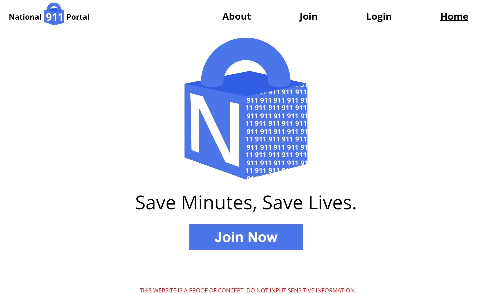

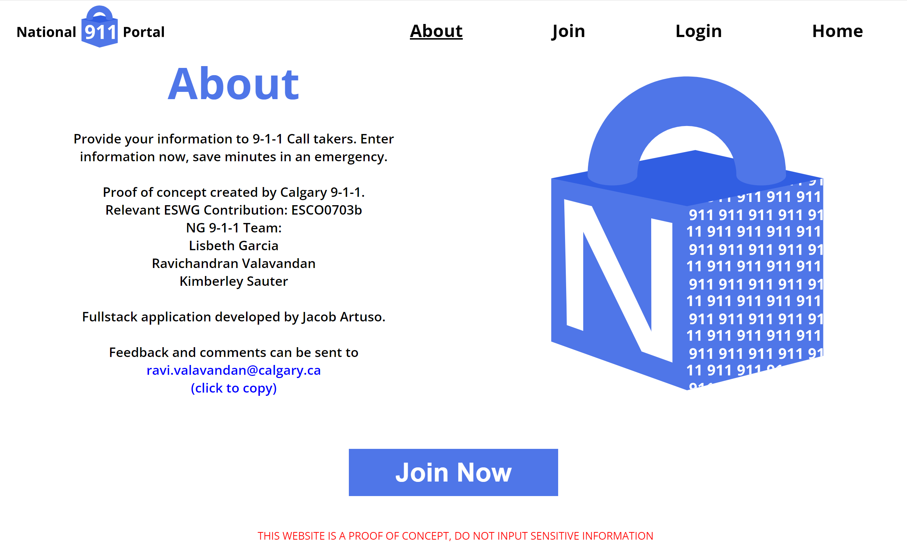

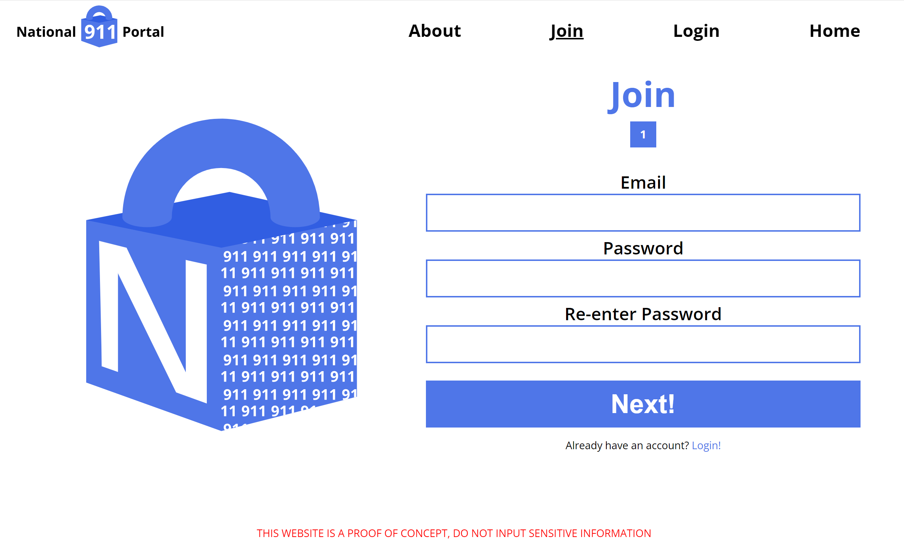

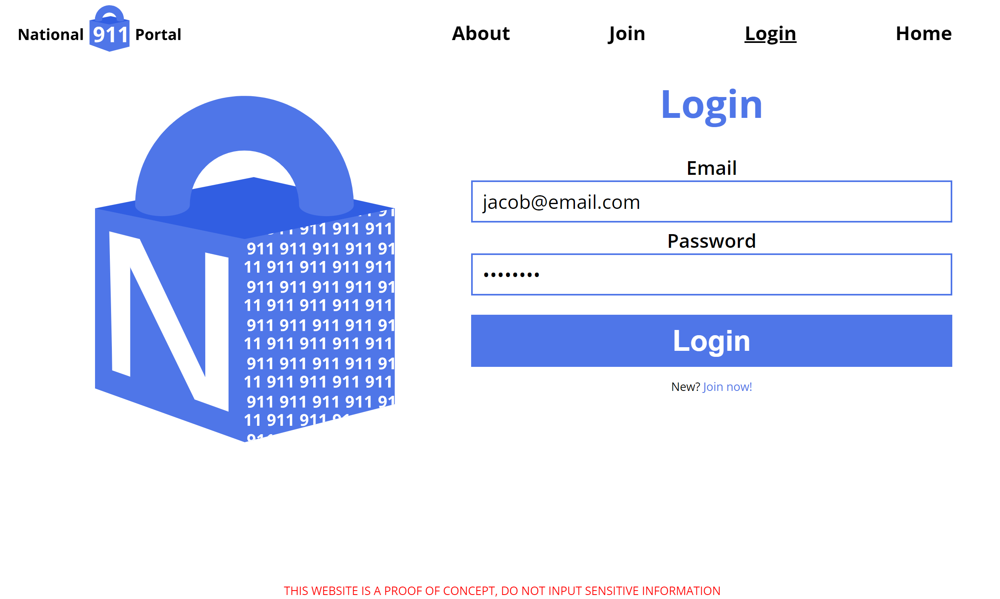

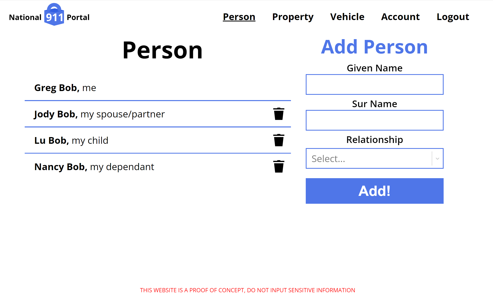

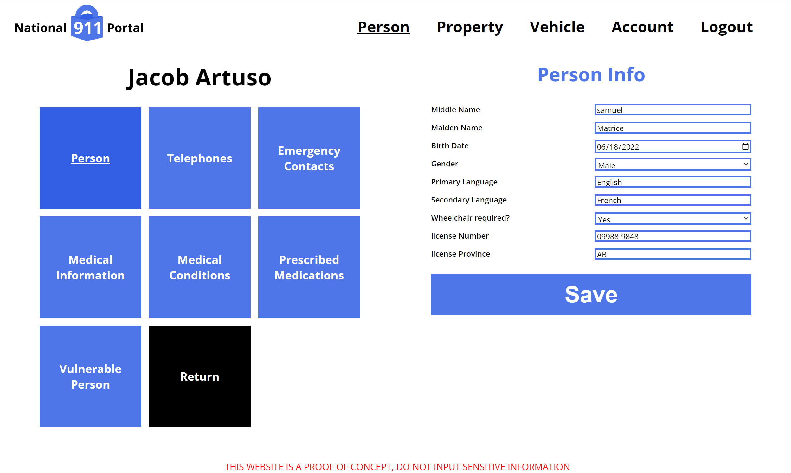

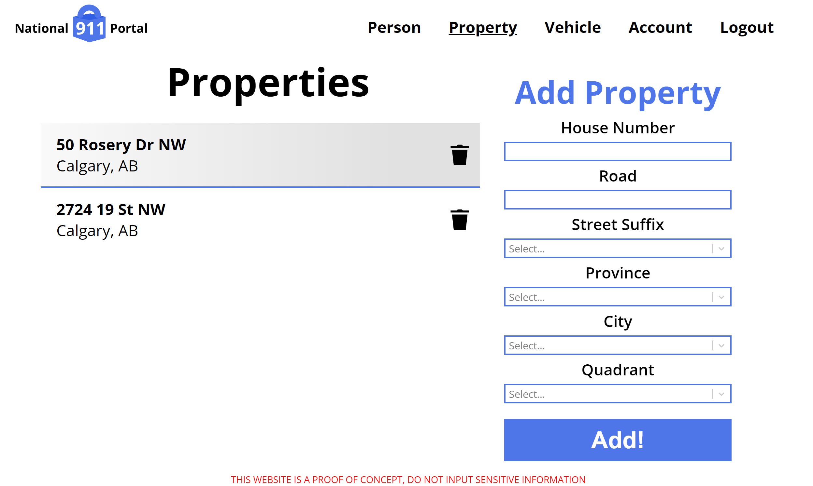

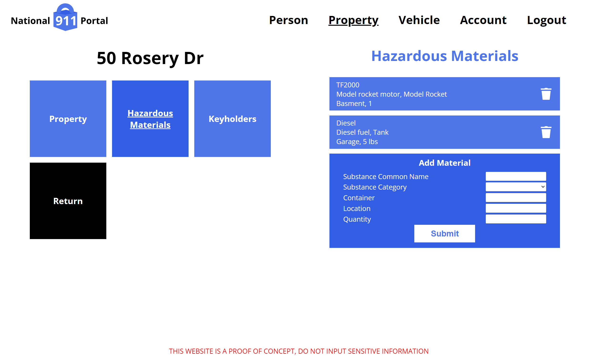

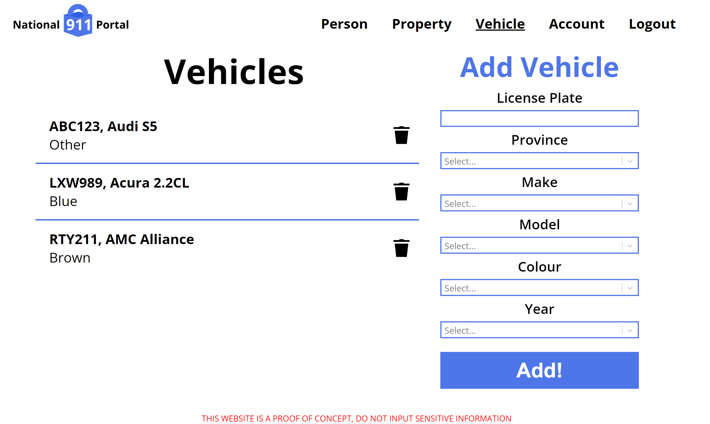

## PSAP Interface

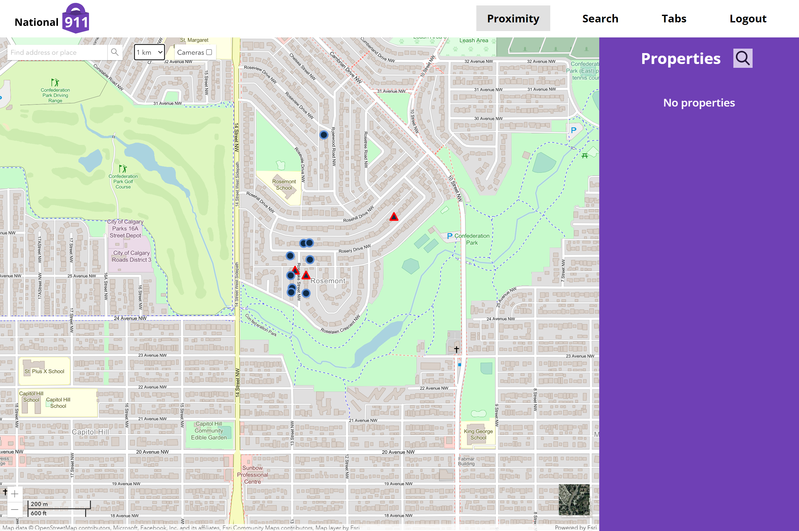

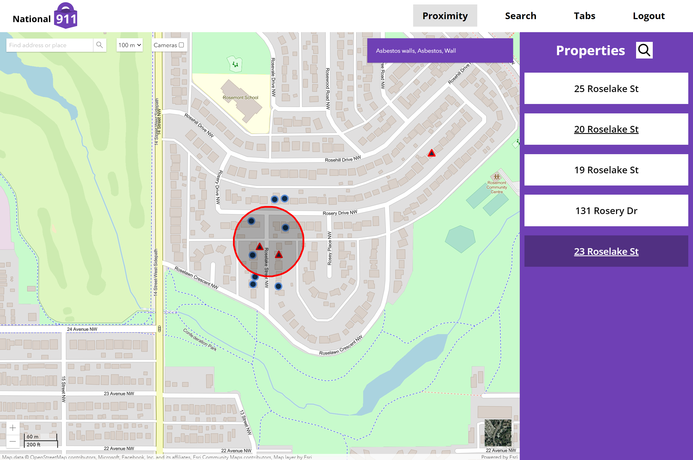

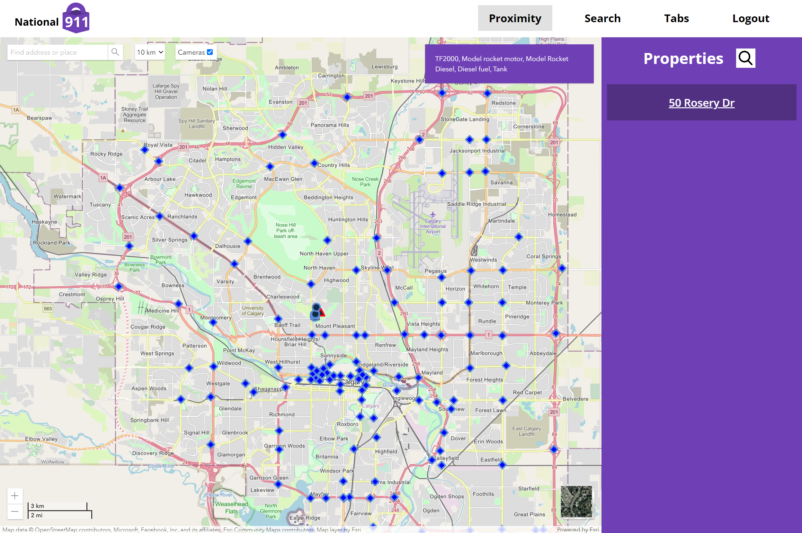

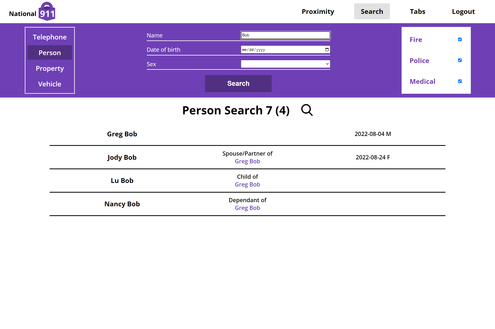

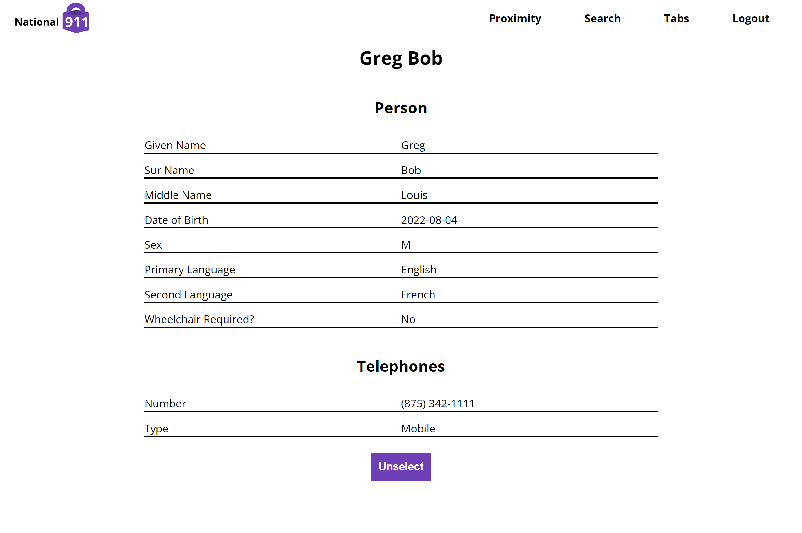

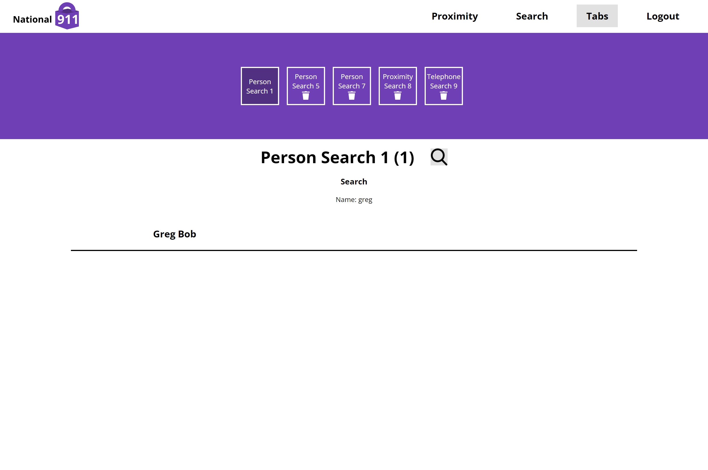

[1]: https://developers.arcgis.com/javascript/latest/
[2]: https://www.npmjs.com/package/@arcgis/core
[3]: https://www.npmjs.com/package/@react-google-maps/api
[4]: https://www.npmjs.com/package/react-google-places-autocomplete
[5]: https://gradle.org/install/
[6]: https://nodejs.org/en/
[7]: https://www.java.com/en/download/
